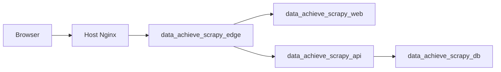
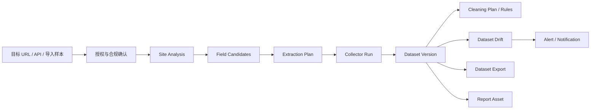
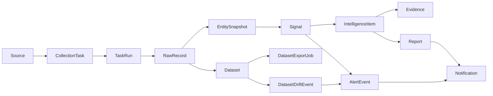
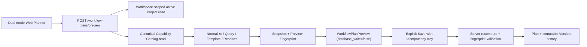
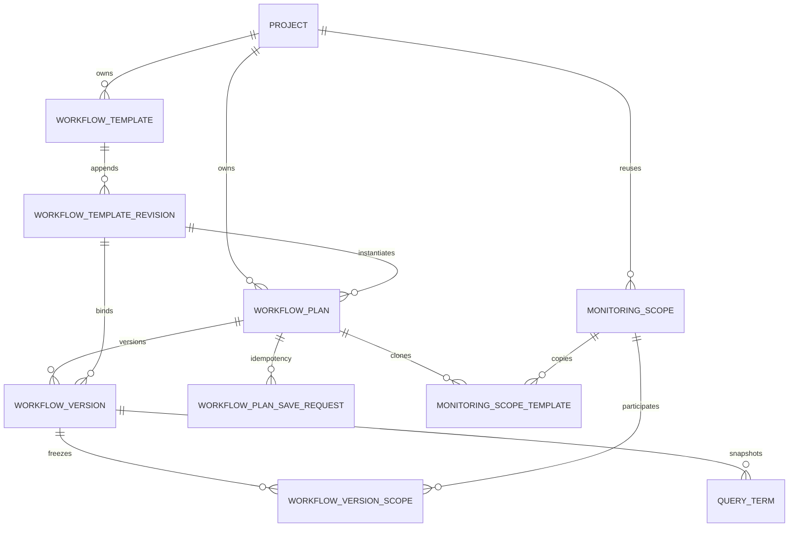

# Data Intelligence Hub 技术架构

## 架构目标

Data Intelligence Hub 是数据采集工作台，不是静态展示站。系统目标是把不同平台的数据采集方法、采集任务、原始记录、实体快照、变化信号、情报、报告、告警和通知串成可追溯闭环。

当前稳定边界：

1. 前端使用 Next.js 15 + React 19，生产环境关闭 mock API。
2. 后端使用 FastAPI + SQLAlchemy 2.0 + PostgreSQL。
3. 采集器支持 `github_repo`、`github_topic`、`generic_web`、`public_feed`、`manual_json`、`ecommerce_product_discovery`、`ecommerce_product_page`；商品页 collector 支持 JSON-LD Product 和静态 schema.org microdata 基础字段；公开网页结构预检属于 `/api/toolkit/preflight` 能力，不作为长期 Source collector。
4. 自动采集工作台通过 `/api/automation` 串联站点分析、商品发现、fan-out、批量运行、Dataset 保存、漂移检查、告警和导出。
5. 情报生成遵循证据优先：事实来自 RawRecord、EntitySnapshot、Signal、Evidence，LLM 或 mock LLM 只生成摘要文案。
6. 生产部署在腾讯云轻量服务器的独立 Docker Compose 环境内，不复用其他应用容器、数据库或 volume。
7. GOAL-V2-03 Phase 1 Preview、Phase 2 persistence 与首个 Plan lifecycle foundation 已完成本地 L2 slice；Planner 仍不调度或执行计划。GOAL-V2-05A 新增独立 fixture-only `workflow_execution` bounded context，可对指定不可变 Version 生成本地 WorkflowRun/StepRun；Web 现提供只读 `/automation/runs` history surface，但不开放 live Provider 或执行授权。

## 运行拓扑



生产容器：

| 服务 | 容器 | 职责 | 对外暴露 |
|---|---|---|---|
| `web` | `data_achieve_scrapy_web` | Next.js 页面服务 | 仅内部网络 |
| `api` | `data_achieve_scrapy_api` | FastAPI、调度器、采集与情报服务 | 仅内部网络 |
| `db` | `data_achieve_scrapy_db` | PostgreSQL 16 | 仅内部网络 |
| `edge` | `data_achieve_scrapy_edge` | Nginx 反向代理 `/api` 与页面 | 通过外部网关网络接入 |

网络与隔离：

1. `data_achieve_scrapy_internal` 只服务本项目。
2. `lighthouse_ai_video_net` 仅用于让宿主机网关 Nginx 访问 `edge`。
3. PostgreSQL volume 为 `data_achieve_scrapy_postgres_data`，不与其他应用共享。
4. 生产敏感配置只在 `/opt/data-achieve-scrapy/.env.production`，不进入仓库。

## 自动采集工作台闭环

当前产品定位已从“工具情报展示”推进为“自动化数据采集工作台”。工具情报仍保留，但它的架构角色是采集策略推荐层，而不是主链路。

自动采集主链路：



当前实现边界：

1. `SiteAnalysis` 与 `ExtractionPlan` 已升级为可保存、可查询、可复制版本的正式资产。
2. `CleaningPlan` 已升级为可保存、可试跑、可被数据集版本追踪的正式草案资产。
3. `Dataset`、`DatasetVersion`、`DatasetDriftEvent`、`DatasetExportJob` 已有后端模型与 `/datasets` 前端入口。
4. Dataset 导出文件写入 `Settings.dataset_export_dir`，默认值为 `tmp/dataset-exports`；生产持久化目录和对象存储策略需要在部署层单独核验。
5. GitHub Topic Radar 运行记录已可保存为 `github_tool_radar` DatasetVersion，并可生成工具雷达只读报告、漂移快照和 `report_type=github_tool_radar` 的 Report 中心资产。
6. Public Web/RSS/Docs 已从本地切片推进到小范围生产门禁：`public_feed` RSS、`generic_web` docs/page、`public_content_update` DatasetVersion、content-hash drift、`public_content_drift` 事件、只读 report preview、Report asset、Dataset export、scheduler approval/tick、retained canary refresh、cleanup dry-run 和 default 168h TTL final observation 均有历史证据；provider/email、production browser run、browser artifact write、cleanup execute 和 post-cleanup recount 仍需单独 gate。
7. 截至 2026-06-30，Automation 平台包、采集计划、清洗计划、数据集保存、GitHub Topic Radar、公开网页结构预检、公开 RSS/Atom 与 docs/page Dataset/drift/report preview、工具雷达 Report 资产、BrowserDiagnosticRun/Job/JobRun 只读证据资产、CapabilityProbe/BrowserDiagnostic computed evidence reference、BrowserDiagnostic Source/Task 候选 preview gate、BrowserDiagnostic no-write execution dry-run、BrowserDiagnostic 显式授权 Source+Task 写 gate、BrowserDiagnostic production metadata-only no-run gate、生产浏览器链路合同和 GitHub API-first 深化字段合同已形成产品骨架；运行安全本地切片已补齐 task row lock、collector timeout、scheduler running-task skip、前端 submitting guard、auto freshness retry budget、手动 Task run、Dataset export create、Report send、drift alert notification/email send、Report asset create、subscription run/retry、email-channel test、email provider-live gate preflight、email provider live-send readiness 和 email provider live-send gate default-deny 的 `Idempotency-Key` replay 合同；Batch 3 已把 PlatformPackage 本地 API/UI 合同补成 version、owner、lifecycle status、evidence grade、authorization required、acceptance registry、cleanup policy 和 forbidden actions；后续重点是按 L4 runbook 执行真实 provider 生产发送证据、平台包持久化/自定义层、更多平台包真实采集深度与长期运行可靠性。

当前平台包矩阵：

| id | 分类 | version | evidence grade | 默认入口 | 执行边界 | 当前状态 |
|---|---|---|---|---|---|---|
| `shopify-independent-ecommerce` | ecommerce | `2026.06.m4` | `L2-fixture-or-dry-run` | `product-discovery` | `executable` | 可从集合页发现商品、fan-out、批量运行并保存 Dataset；WebScraper.io 公开测试站 local API E2E 已验证静态 microdata 商品页到 export/drift；生产/客户站 gate 待授权 |
| `github-api-first` | developer_platform | `2026.06.m3` | `L4-authorized-live` | `source-create` | `executable` | 可从 `/automation` 创建 GitHub topic Source、启用 Task 并执行一次公开 API 采集；M3 已补充 license、default branch、latest release、pushed_at 等 API-first 字段合同；L4 仅指 scoped package gate |
| `public-page-structure-preflight` | browser_preflight | `2026.06.preflight` | `L2-fixture-or-dry-run` | `preflight` | `executable` | 可对授权公开网页做结构预检，并在允许时转入 `generic_web` 采集源 |
| `public-web-rss-docs` | public_content | `2026.06.m5` | `L4-authorized-live` | `source-create` | `executable` | 已完成小范围 `public_feed` RSS 与 `generic_web` docs/page 生产门禁，支持 `public_content_update` Dataset save、content-hash drift、drift event、只读 report preview、Report asset、Dataset export、scheduler tick、retained canary refresh 和 default 168h TTL final observation；provider/email、生产浏览器运行、cleanup execute 和 post-cleanup recount 仍待单独授权 |

## 数据闭环



核心不变量：

1. `RawRecord` 是事实入口，必须保留 `content_hash` 和采集时间。
2. `EntitySnapshot` 是可比较状态，不直接覆盖历史。
3. `Signal` 只描述确定性变化或异常，不承载自由文本结论。
4. `IntelligenceItem` 的评分来自规则公式，摘要文案不能新增事实。
5. `Evidence` 必须能追溯到 signal、entity、raw record 或 URL。
6. Report、Alert、Notification 都消费已存在的情报和证据，不绕过证据链。
7. Dataset 是面向下游交付的结构化资产，必须能追溯到 TaskRun、RawRecord 和字段选择。
8. DatasetExportJob 是受控导出记录，必须记录格式、文件名、大小、行数、checksum 和审计事件。

## 模块分层

| 层 | 目录 | 职责 |
|---|---|---|
| API route | `apps/api/src/data_intelligence_hub/api/routes/` | HTTP 入口、鉴权上下文、schema 响应 |
| Service | `apps/api/src/data_intelligence_hub/services/` | 业务流程、采集运行、信号生成、情报生成、报告、告警、通知 |
| Repository | `apps/api/src/data_intelligence_hub/repositories/` | SQLAlchemy 查询与持久化 |
| Model | `apps/api/src/data_intelligence_hub/models/` | 数据表映射与关系 |
| Schema | `apps/api/src/data_intelligence_hub/schemas/` | Pydantic 请求与响应合同 |
| Web app | `apps/web/src/app/` | 页面路由 |
| Web lib | `apps/web/src/lib/` | API client、mock API、格式化工具 |
| Web types | `apps/web/src/types/` | 前端类型定义 |

## Workflow Planner：Phase One Preview 与 Phase Two Persistence

当前 GOAL-V2-03 状态是 `payload_bound_fixture_materialization_postgres_accepted_live_provider_pending`。Phase One Preview 仍是纯、确定性且 write-free 的领域入口；Phase Two 保存不可变 Plan/Version 历史，并在本地实现 clone/copy provenance、六态 Plan transition、append-only WorkflowTemplate Revision、Plan instantiation、fixture-only WorkflowRun、lineage-preview v2 与 Provider-neutral offline payload materialization。Revision `202607170034` 已仅在 exact disposable target 通过 guarded `033→034→033→034` 和 PostgreSQL `13/13`；live Provider 仍未实现或授权。



Phase One 仍由 `schemas/workflow_planner.py`、normalization、candidate expansion、query compiler、templates、resolver、fingerprint、planner 与 Preview route 组成。它只读取 active Project 和 canonical Catalog；candidate Assertion 只能得到可解释 `held`，Primary/Fallback/Shadow/partial 只来自 test-only synthetic Fixture。Web 的 shared Project selection provider 只在接受匹配 Project 的 Preview 后标记 applied；输入、mode、Project 或请求上下文变化会将旧 Preview 置为 stale。

Phase Two 将持久化职责隔离到 `workflow_plan_persistence.py`、`models/workflow_plan.py`、`repositories/workflow_plans.py`、`services/workflow_planner/persistence.py` 和同一路由模块，不把 Save/history 逻辑塞回 Phase One Preview 模块。数据关系是：



Phase Two 基础表之外，clone/copy source 增加 `workflow_plans` 的 source Plan/Version pair 与独立的 `monitoring_scope_templates` append-only asset；lifecycle foundation 增加 Project-scoped `workflow_templates`，Revision association 增加 immutable `workflow_template_revisions` 与 Plan/Version lineage pair。Project 内按 `scope_key` 复用 canonical Scope；Version–Scope 关联冻结顺序；QueryTerm 是 Version 级快照；Plan 默认仍由 Save/clone/Template instantiate 创建为 `previewed`，但 status check 与 transition service 已覆盖 `draft/previewed/approved/active/paused/archived`，`current_version_id` 继续指向不可变 Version。Clone 复制冻结 source Version 为新的 Plan/v1，Scope copy 只生成 template，不向 canonical Scope 表写重复语义。Revisions `202607160030`/`031`/`032` 已在 fresh PostgreSQL 15 upgrade 路径建成；独立 downgrade lifecycle 仍只有本次明确验证的 `032↔033`。

保存服务拥有唯一业务事务边界：先安全清理无修改的 auth read autobegin，随后在一个 transaction 内校验/重放 Idempotency-Key、锁定 Project，再锁定 Plan（仅后续 Version）、服务端重算 Preview 和 Fingerprint、检查乐观并发、复用/创建 Scope、写入 Version/关联/QueryTerm/current pointer/response snapshot。`semantic_no_op` 不推进 Version；A→B→A 会创建 v3。相同 key 不同请求返回冲突；并发写只有一个请求能推进 current Version。读取、history 和 Compare 使用 tenant-scoped read path，archived Project 保持可读但不能 Preview 或 Save。

Web 继续以 Preview 为 Save 前提：变更输入会使 Preview stale 并禁用 Save；`preview_stale`/`version_conflict` 保留本地草稿并刷新并发基线。已保存的 Plan 在 `/automation/plans` 和显式 Project-scoped detail URL 中展示 current Preview、累积 Version history、服务端 Compare facts，以及 active Project 下的 Plan clone / Scope template copy actions；Web status union 已与六态 API 合同对齐。Planner 现以五阶段呈现 Preview 与 Review/Save，并显示 blocker、版本影响及分离的 Save/Approve/Activate/Run 边界；只有 Save 可执行，后三项只是带缺失原因的 disabled gate。前端不自行计算 diff。历史 `从 vN 在 Planner 中继续` 仍是编辑草稿路径，不等于 clone。Planner UI 仍不提供可执行的 Activate、Run、Schedule、Provider 或 WorkflowRun 操作；05A fixture routes 仅是后端本地合同。

当前证据边界：

```text
GOAL-V2-03 status=lineage_postgres_acceptance_complete_provider_pending
implementation_baseline_reference=1e4cc4863c9629e2ff249edc0f7722dafaaf6831
phase_2_checkpoint_commit=39c07e9baf12ec2ec8a1a21afc4b4feacffc4d12
checkpoint_commit_present=true
database_write=local-test-only
migration_applied=202607160033 historical exact target only; revision_034_execution_authorization=false
provider_call=false
actor_run=false
browser_run=false
llm_call=false
workflow_run_created=local-test-only; cleanup=0
raw_record_write=local-test-only; cleanup=0
dataset_write=local-test-only; cleanup=0
production unchanged
plan_lifecycle_transition=local_sqlite_green
workflow_template_persistence=local_sqlite_api_green
template_revision_association=local_api_sqlite_web_green
local_api_full_pytest=910_passed_66_skipped_14_warnings
persisted_lineage_contract_api_focused=49_passed
lineage_postgres_guard=passed; postgres_cases=7_passed; lifecycle=032_to_033_to_032_to_033
local_template_sqlite=5_passed
local_web_full_unit=246_passed; typescript_eslint_build=passed
local_web_static_mock_e2e=72_passed_12_expected_skipped
phase_1_web_mock_e2e=passed
phase_2_web_mock_e2e=passed
task_15_full_exit_gate=historical; clone/copy focused gate=passed
local_playwright_browser=managed_chromium_headless_shell_installed
```

上述 Phase Two 本地证明包括模型/路由/Web、SQLite atomic service/rollback/replay、StepRun-bound payload registry、state-aware lineage-preview v2、只读 `/automation/runs` compatibility、canonical RawRecord/DatasetVersion V2 provenance 和 revision-034 PostgreSQL acceptance。API full 为 `976 passed / 72 skipped / 6 warnings`；warnings 为 1 个既有 passlib deprecation 和 5 个既有 retention 测试的 aiosqlite event-loop-close warnings。13 个 revision-034 PostgreSQL cases 在唯一授权目标全部通过，cleanup head 034 且业务表零行。没有执行 live Provider、real API、CI、共享/生产数据库、部署或生产验收；Template lifecycle UI 与 live execution 仍未完成。

## Workflow Execution：GOAL-V2-05A Fixture Kernel

`workflow_execution` 是与 Planner、旧 `CollectionTask/TaskRun` 并列的 bounded context，不把旧 TaskRun 改名为 V2 WorkflowRun，也不改变 Planner 的 `previewed`/immutable Version 语义。当前 Run response 从 tenant-safe immutable Version 读取并暴露 `(workflow_template_id, workflow_template_revision_id)`；不在 `workflow_runs` 重复存储该 pair。

```text
WorkflowPlan + immutable WorkflowVersion + expected fingerprint
  -> integrity / Primary-only fixture eligibility
  -> registered Fixture profile + deterministic adapter
  -> transaction-owned WorkflowRun + StepRun + request ledger
  -> completed fixture receipt / idempotent replay

StepRunAttempt + WorkflowFallbackDecision
  -> tenant-scoped repository reads
  -> workflow_attempt_fallback_evidence.v1 validation
  -> read-only Run detail business summary + folded diagnostics
```

实现分层为：

| 层 | 文件 | 职责 |
|---|---|---|
| API route | `apps/api/src/data_intelligence_hub/api/routes/workflow_runs.py` | Auth、tenant scope、DTO、`X-Request-ID`、fixture-only error mapping |
| Schema | `apps/api/src/data_intelligence_hub/schemas/workflow_execution.py` | Run/Step DTO、digest/profile/idempotency 格式与 false boundary flags |
| Attempt/Fallback read schema | `apps/api/src/data_intelligence_hub/schemas/workflow_attempt_fallback.py` | 连续 attempt、ownership、七段 Fallback gate、field/cost/approval consistency 与固定 non-live/no-switch boundary |
| Checkpoint/Budget read schema | `apps/api/src/data_intelligence_hub/schemas/workflow_checkpoint_budget.py` | Run/session/Step ownership、cursor chain、checkpoint-reservation coverage、五维累计账本与固定 no-resume/no-override boundary |
| Provider Health read schema | `apps/api/src/data_intelligence_hub/schemas/workflow_provider_health.py` | Frozen candidate order、latest snapshot version/hash chain、routing TTL、exact feedback capability/order match 与固定 no-probe/no-mutation/no-switch boundary |
| Lineage schema/service | `apps/api/src/data_intelligence_hub/schemas/workflow_lineage.py`, `apps/api/src/data_intelligence_hub/services/workflow_execution/lineage_preview.py` | Provider-neutral envelope、lineage digest、eligibility 与 state-aware preview；读取时重验注册 envelope 和持久化资产 |
| Persisted lineage contract | `apps/api/src/data_intelligence_hub/models/raw_record.py`, `apps/api/src/data_intelligence_hub/models/dataset.py`, `apps/api/alembic/versions/202607160033_workflow_raw_dataset_lineage.py` | canonical RawRecord/DatasetVersion 的互斥 legacy/V2 provenance、tenant FK 与 content deduplication |
| Materialization ledger/revision | `apps/api/src/data_intelligence_hub/models/workflow_execution.py`, `apps/api/alembic/versions/202607170034_workflow_lineage_materialization.py` | 每个 Run 一个 DatasetVersion、exact idempotency ledger、tenant composite FKs；revision 034 exact disposable PostgreSQL `13/13` 已通过 |
| Repository | `apps/api/src/data_intelligence_hub/repositories/workflow_execution.py`, `apps/api/src/data_intelligence_hub/repositories/workflow_lineage.py` | workspace→Project→WorkflowRun lock order、tenant-scoped asset/ledger reads and writes |
| Service | `apps/api/src/data_intelligence_hub/services/workflow_execution/materialization.py` | StepRun/envelope 写前绑定、单事务 RawRecord/DatasetVersion/ledger、rollback、race recovery、replay validation |
| Web | `apps/web/src/components/workflow-execution/workflow-run-history-workspace.tsx`, `apps/web/src/lib/api/workflow-runs.ts` | Project-scoped fixture Run list/detail、Template/Revision lineage、StepRun、Shadow、Attempt/Fallback、Checkpoint/Budget、Provider Health evidence；业务摘要优先、诊断折叠，只读且无 materialization/retry/resume/override/switch 控件 |

后端新增 `POST /api/projects/{project_id}/workflow-runs/{run_id}/materializations`，仅接受 Dataset 名称、expected lineage digest 和 `Idempotency-Key`，不接受 record bodies。服务从 payload-bound StepRun 重新加载 server-registered envelope，按 workspace→Project→Run 加锁，并在同一事务写 RawRecord、一个 DatasetVersion 和 completed ledger；same-key exact replay 返回原资产且 write flags 为 false。不同 key 对同一 Run 冲突。GET lineage-preview 始终 write-free；物化后只有 ledger、DatasetVersion、ordered RawRecords、StepRuns 与注册 envelope 全部一致才返回资产 IDs。Web 仍只读。

2026-07-24 新增的 `GET .../attempt-fallback-evidence` 是独立 child resource，没有扩展
共享 `WorkflowRunDetailResponse`。该边界避免把 attempt/fallback 的更高变化频率耦合进
Run 核心 DTO，并把 persisted Evidence 的读取、严格验证和产品呈现与 execution action
分开。Repository 只读取所属 Run 的 `StepRunAttempt`/`WorkflowFallbackDecision`；Schema
在返回前验证连续序列、资源归属和 gate/decision 一致性；Web mapper 再按当前 detail 的
Step/Plan/Version 上下文 fail closed。该流没有写路径、Provider 调用或自动路线切换。

同日新增的 `GET .../checkpoint-budget-evidence` 继续采用 child-resource 组合方式，不把
高变化率的分页/预算证据塞入共享 `WorkflowRunDetailResponse`。Repository 用 workspace、
Project、Plan、Version、Run/session 约束读取 checkpoint/account，并按 account 读取 ledger；
Schema 重验 cursor chain、hash predecessor、五维累计与 reservation coverage，Web mapper
在当前 detail Step 集合上再做上下文校验。UI 只呈现 confirmed facts、held reason 与折叠
diagnostics，显式不开放 resume 或 budget override。它连接的是读路径，不等于把 standalone
executor 组合进产品状态机，也不构成 PostgreSQL、live Provider 或生产验收。

Provider Health 使用第三个独立 child resource
`GET .../provider-health-evidence`。组合从 immutable Step route plan 出发，不把健康快照
误写成 Run 自身观测：Repository 只读取同 Project/capability/candidate 的 RUN-10 记录，
route 层选取每个 implementation 最新快照并重验 version/hash chain，再以 read time 区分
active/expired routing influence。反馈只有 original candidate order 与 capability identity
完全匹配才挂接；Web mapper 再与当前 Run detail Step 集合核对。该读链只解释已有
fixture Evidence，不主动 probe、不修改 Catalog 或当前 Run route、不执行自动切换，也不
构成 revision 042 PostgreSQL、live Provider 或生产验收。

Task 13 实测证据（2026-07-16）仅来自 `127.0.0.1:55367/local_workflow_execution_test`：Alembic `028→029→028→029` 与 guarded PostgreSQL suite `14 passed`；cleanup head `202606110029`，`workflow_runs`、`step_runs`、`workflow_run_requests` 均 0 行，Governance `catalog_head=global|NULL|0` 和 WorkflowPlan/Version 行数均 0。该 L2 local disposable proof 不升级 Provider/RawRecord/Dataset lineage、live execution、CI、部署或生产；Web Run history 的 `246` unit/build 证据是独立本地只读层。

## Automation 与 Dataset 模块

| 模块 | 主要文件 | 当前职责 |
|---|---|---|
| Automation routes | `apps/api/src/data_intelligence_hub/api/routes/automation.py` | `/api/automation` HTTP 入口 |
| Automation service | `apps/api/src/data_intelligence_hub/services/automation_service.py` | 站点分析、商品发现、fan-out、批量运行、Dataset、漂移、告警和导出流程 |
| Automation schemas | `apps/api/src/data_intelligence_hub/schemas/automation.py` | 自动采集请求与响应合同 |
| Dataset models | `apps/api/src/data_intelligence_hub/models/dataset.py` | Dataset、DatasetVersion、CleaningPlan、DatasetDriftEvent、DatasetExportJob |
| Dataset repository | `apps/api/src/data_intelligence_hub/repositories/datasets.py` | Dataset 查询、版本、漂移与导出任务持久化 |
| CleaningPlan repository | `apps/api/src/data_intelligence_hub/repositories/cleaning_plans.py` | CleaningPlan 查询、版本号和持久化 |
| Automation page | `apps/web/src/components/automation/automation-workbench.tsx` | 自动采集工作台 |
| Dataset page | `apps/web/src/components/datasets/datasets-workspace.tsx` | 数据集资产台、导出与漂移历史 |

后续应新增或拆分：

1. `PlatformPackage` 持久化和自定义层，用于 Shopify、GitHub/API-first、marketplace、social 等平台包的版本管理和交付验收；当前版本/owner/验收登记仍来自代码内 catalog。
2. 清洗计划规则编辑器和更完整的 before/after 预览。
3. Operator UI 中展示 retry budget 耗尽原因、重置入口和下一次可运行状态。
4. Side-effect endpoint 的统一幂等键或等价去重策略，用于防止重复点击、scheduler 并发或网络重试造成重复资源；当前手动 Task run、Dataset export create、Report send、drift alert notification/email send、Report asset create、subscription run/retry、email-channel test、email provider-live gate preflight、email provider live-send readiness 和 email provider live-send gate default-deny 已有本地合同，真实 provider 生产发送仍需按 L4 runbook 获取审批和 side-effect 证据。

## 采集与调度

采集任务的稳定路径：

1. 创建 `Source`。
2. 执行配置校验。
3. 启用 source，生成或更新 `CollectionTask`。
4. 手动运行或调度器运行 task。
5. Collector 返回结构化 payload。
6. 写入 `TaskRun`、`RawRecord`。
7. Normalization 生成 `Entity` 与 `EntitySnapshot`。
8. Signal service 比较快照并生成 `Signal`。
9. Intelligence service 生成 `IntelligenceItem` 和 `Evidence`。
10. 自动采集流程可以从 TaskRun 聚合生成 DatasetVersion，并进一步生成 DatasetDriftEvent、AlertEvent、Notification 或 DatasetExportJob。

当前稳定 collector：

| type | 用途 |
|---|---|
| `github_repo` | 监控公开 GitHub 仓库指标 |
| `github_topic` | 按公开 topic 发现 GitHub 仓库 |
| `generic_web` | 采集公开网页或 docs/page 快照，并为 public-content docs diff 提供页面级 content hash |
| `public_feed` | 采集公开 RSS/Atom feed 更新条目 |
| `manual_json` | 导入人工或外部工具结构化样本 |
| `ecommerce_product_discovery` | 从独立站列表页或 sitemap 发现商品 URL |
| `ecommerce_product_page` | 从公开独立站商品页解析结构化商品字段；优先 JSON-LD Product / Offer，兼容静态 schema.org microdata |

平台边界：

1. Shopify-style 独立站是当前第一平台包。
2. GitHub/API-first 平台包适合承接采集工具情报监控。
3. Amazon、Temu、Shopee、Lazada 等 marketplace 应优先走官方 API、授权导出或人工导入。
4. TikTok、Instagram、X、小红书等社媒平台在未明确授权和平台政策前，不实现登录态抓取、反检测或风控绕过。

调度器当前是进程内轻量调度，由 `SCHEDULER_ENABLED` 控制。生产 compose 支持开启，默认值由远程 `.env.production` 决定。后续如果任务规模增大，应把单 owner 机制升级为独立 worker 或 Temporal。

## LLM 边界

当前生产 `LLM_PROVIDER=mock`。这不是事实生成器，只是可插拔 adapter 的本地实现。

约束：

1. system prompt 固定要求基于 verified evidence。
2. user prompt 固定禁止编造事实。
3. adapter 返回值必须是 JSON object。
4. JSON 必须包含 string 类型的 `title` 与 `summary`。
5. 无效 JSON、非 object、非 string 字段统一抛出 `TypeError`。

真实 LLM 接入前必须保留同一 schema guard，并新增 provider 级超时、重试、配额和审计日志。

## 生产验收事实

当前基线，截至 2026-06-29，已验证：

1. 生产只读 health 返回 `environment=production`、`status=ok`、`database=connected`、`schema=current`、`schema_revision=202606110023`、`schema_head=202606110023`、`scheduler_enabled=true`。
2. 生产 active app working tree `/opt/data-achieve-scrapy/app` 的 `HEAD` 为 `42851929d59d82708c9380d36347ca721979297d`。
3. 生产 active app marker `/opt/data-achieve-scrapy/app/.deploy-sha` 为 `42851929d59d82708c9380d36347ca721979297d`，与 active app `HEAD` 匹配。
4. `data_achieve_scrapy_api` 和 `data_achieve_scrapy_web` 的 compose working directory 均为 `/opt/data-achieve-scrapy/app/configs/deploy/scrapy`。
5. 本地 main worktree 与 `origin/main` 均指向 `42851929d59d82708c9380d36347ca721979297d`。
6. 本次只读核验不执行 production write、provider call、email send、cleanup execute、scheduler mutation、production browser run 或 browser artifact write。

历史基线，截至 2026-06-14，已验证：

1. 本地 `bash scripts/verify-mvp.sh` 通过：API `45 passed`，Web build 通过，Playwright `17 passed, 5 skipped`。
2. 生产 `https://scrapy.lute-tlz-dddd.top/api/health` 返回 `production`、`ok`、`database=connected`。
3. 生产真实 API E2E 通过：Playwright `17 passed, 5 skipped`。
4. 演示数据项目域覆盖 `competitor`、`ecommerce`、`osint`、`social`。
5. 演示数据 collector 覆盖 `generic_web`、`github_repo`、`manual_json`。

截至 2026-06-19，commit `d9b2a5e` 已验证：

1. `/api/automation` 路由已存在，覆盖 site analysis、product discovery、fan-out、batch run、Dataset、drift、alert 和 export。
2. `DatasetExportJob` 模型、导出服务、导出历史接口和下载接口已存在。
3. 前端 `/datasets` 已存在生成导出文件和下载导出文件的交互。
4. `/api/automation/platform-packages` 在生产返回 3 个平台包，包含 `public-page-structure-preflight`，且 `github-api-first` 已是可执行平台包。
5. 生产运行目录为 `/opt/data-achieve-scrapy/app`，该轮目录 HEAD 为 `d9b2a5e`；远程 GitHub fetch 曾遇到传输失败，该次部署采用本地已推送 commit 的 git bundle fast-forward。
6. 生产健康检查返回 `status=ok`、`database=connected`、`schema_revision=202606110020`、`schema_head=202606110020`。
7. 生产真实 API E2E 通过：Playwright `34 passed / 8 skipped`。
8. E2E 与 demo 噪音清理已执行，后续 dry-run 计数为 0。
9. Report 中心已支持 `report_type=github_tool_radar` 的工具雷达资产；该保存动作不启动采集、不创建通知、不发送邮件。
10. `/api/toolkit/preflight` 返回 `collection_strategy`，生产只读 smoke 已确认 `recommended_path=generic_web`、`fit=high`、`run_started=false`。

截至 2026-06-21，production HEAD `80f0566` 已验证：

1. 生产运行目录 `/opt/data-achieve-scrapy/app` 已通过 git bundle fast-forward 更新到 `80f0566288ab1cab3348730c65df811bcfd42d9a`。
2. 生产 Alembic migration 已从 `202606110020` 升级到 `202606110023`，覆盖 BrowserDiagnosticRun/Job/JobRun 表。
3. 生产健康检查返回 `status=ok`、`database=connected`、`schema_revision=202606110023`、`schema_head=202606110023`。
4. `api`、`db`、`web`、`edge` compose 服务均为 healthy，外层 gateway reload 和 dry-run check 均通过。
5. `/dashboard`、`/intelligence`、`/reports`、`/tasks`、`/sources`、`/alerts`、`/notifications`、`/projects`、`/signals`、`/raw-records`、`/entities`、`/automation`、`/datasets` 均返回 200。
6. Demo 账号 authenticated read-only API smoke 通过，覆盖 session、dashboard、tasks、reports、alert events、notifications。
7. 本轮未执行生产写入 E2E、未创建测试用户、未触发 provider call、未发送邮件或外部通知。

截至 2026-06-21，production HEAD `e9ccb81` 已验证：

1. 生产运行目录 `/opt/data-achieve-scrapy/app` 已通过 git bundle fast-forward 更新到 `e9ccb814899231d49be2f130ed0a9ee9599c93fc`。
2. 生产 Alembic schema 仍为 `202606110023`；M3 GitHub API-first 深化未新增 migration。
3. 生产健康检查返回 `status=ok`、`database=connected`、`schema=current`、`schema_revision=202606110023`、`schema_head=202606110023`。
4. `api`、`db`、`web`、`edge` compose 服务均为 healthy，外层 gateway reload 和 dry-run check 均通过。
5. `/dashboard`、`/intelligence`、`/reports`、`/tasks`、`/sources`、`/alerts`、`/notifications`、`/projects`、`/signals`、`/raw-records`、`/entities`、`/automation`、`/datasets` 均返回 200。
6. Demo 账号 authenticated read-only API smoke 通过，覆盖 session、dashboard、tasks、reports、alert events、notifications。
7. Authenticated read-only `GET /api/automation/platform-packages/github-api-first` 确认 `field_schema.required` 包含 `license_spdx_id`、`default_branch`、`latest_release_tag`、`latest_release_published_at`、`pushed_at`。
8. Cross-domain regression：`video.lute-tlz-dddd.top=200`、`mkt.lute-tlz-dddd.top=200`、`voc.lute-tlz-dddd.top=302`，跟随 redirect 后到登录页返回 200；`scrapy.lute-tlz-dddd.top/api/health=200`。
9. 本轮未执行生产写入 E2E、未创建测试用户/Source/Task/Dataset/Report、未触发 provider call、未发送邮件或外部通知、未执行 scheduler mutation。

## YouTube disabled read Adapter foundation

GOAL-V2-05B 的首个 Adapter slice 是后端纯离线边界，不是 live client：

```text
strict keyword query + opaque credential reference syntax
  -> current Capability Catalog projection (youtube.v3)
  -> manifest-contained recorded search/videos/quota evidence
  -> SHA-256 + typed contract validation
  -> deterministic search.list -> conditional videos.list compiler
  -> method/bucket quota ledger with 30-day freshness
  -> workflow_provider_payload.v1 normalization compatibility proof
  -> authenticated disabled-foundation response

immutable ProviderCallIntent + ProviderCallPolicy + explicit UTC time
  -> server-side prepare_provider_execution_preflight
  -> deterministic preflight + immutable CallAudit draft
  -> blocked: preserve blocker/audit and stop
  -> eligible_for_authorization
  -> prepare_disabled_youtube_execution
  -> youtube_live_execution_disabled
  -X-> execution_allowed=false

credential resolver.resolve / factory.create / Google client / transport / persistence
  -X-> not connected in this slice

YouTube/Reddit adapter-owned raw fixture response
  -> canonical UTF-8 response-size gate
  -> provider-specific adapter normalizer
  -> platform_adapter_normalized_record.v1 + Evidence + payload digest
  -> social_provider business service
  -X-> third-party payload does not cross the adapter boundary

eligible fixture preflight + injected fake transport
  -> deterministic success-only cache lookup
  -> atomic request/quota/cost/rate reservation per attempt
  -> bounded timeout/retry with sanitized terminal status
  -> immutable CallAudit repository interface
  -> explicit cache/audit expiry cleanup
  -X-> credential / live transport / Provider / database not connected
```

`foundation_ready` 描述离线 Adapter 基础是否闭合；optional SDK 是否存在和 caller
是否声明 credential reference 只是独立观测值。Readiness/gate v2 不再把 caller
声明的 prerequisites 推导为执行权限：`execution_enabled=false`、
`provider_call_allowed=false` 是 schema 与 service 的共同不变量。Live execution
入口由 poison boundary 固定拒绝 `youtube_live_execution_disabled`；后续只有新的 L4
授权和独立实现 slice 才能连接 credential resolver、transport、Provider-derived
WorkflowRun/RawRecord/Dataset lineage。

2026-07-22 PAD-01 只增加 `services/provider_execution_preflight.py` 这一层
application seam。它是 `compile_provider_call_preflight` 的唯一生产调用者，返回值
固定 credential read、client construction、transport invocation 与 execution
均未发生；不会从 Route 或 UI 直接编译，也不连接 disabled/live transport。

2026-07-22 PAD-02 增加 `services/disabled_youtube_execution.py`，把 PAD-01 decision、
injected `CredentialResolver` reference 和 `DisabledYouTubeTransportFactory` 组合到既有
poison boundary。blocked preflight 在 boundary 前返回首个 blocker 并保留 audit；
eligible preflight 固定为 `youtube_live_execution_disabled`。该服务源码不调用
resolver.resolve 或 factory.create，poison tests 证明 credential read、client
construction、transport invocation 与 Provider call 均未发生。

2026-07-22 PAD-03 增加 `social_api/output_contracts.py`，冻结 fixture request、
normalized record 与 response schema，并在 provider normalizer 之前执行 raw response
byte limit。YouTube/Reddit adapter module 各自持有 raw fixture builder/normalizer；共享
response 只包含标准 identity、text、metrics、Evidence、payload digest 和 false side-
effect facts。`services/social_provider.py` 对这两个 provider 只消费标准 records，
provider-specific raw keys 不再进入业务层；provider mismatch、oversize、validation
和内部异常均映射为固定 sanitized error code。

2026-07-22 PAD-04 增加 `social_api/provider_fixture_runtime.py`。它复用
`ProviderExecutionPreflightDecision` 的预算与 retry/timeout 上限，但只接收注入的 fake
transport、runtime store、CallAudit repository 和 UTC clock。每次 transport attempt
之前原子预留累计 request/quota/cost 与 rolling rate slot；成功响应才进入 deterministic
TTL cache，cache hit 为零预算。所有 blocked/succeeded/cached/failed 终态写冻结的
`CallAuditRecord`，并通过显式 cleanup 清理过期 cache/audit。当前 store/repository 仅为
in-memory fake；没有 Route、credential、SDK client、live transport、Provider、数据库
model/migration 或持久化 wiring，因此 PAD-004/GOV-003 仍是 L2 fixture/partial。

Cycle-2 将 request validation 保持为 typed OpenAPI body，并只在 YouTube plan 精确
path 使用固定脱敏 422；其他 API validation 继续走 FastAPI 默认 handler。2026-07-19
quota refresh 以后，schema invariant 固定 granular bucket 与 `1/1` 正数 method cost：
`search.list` 使用独立 Search Queries bucket，`videos.list` 使用其他端点的共享 daily
units bucket；每天 100 次 search 上限不再被误写成单次成本。Compiler video ID 与
recorded fixture 使用同一字符合同，fixture response 的 Evidence 上限为合法聚合最大值
10。2026-07-19 quota refresh 的 focused API 为 `68 passed / 1 warning`、full API
为 `1011 passed / 73 skipped / 1 warning`；full Ruff、strict Mypy `313 source files`
与 repository guards GREEN。Task 10 independent review cycle 14 已 clean，本次没有
credential、Provider、migration 或 PostgreSQL 行为。

2026-07-19 B2 在共享 Protocol 之外增加本地 environment source 边界，但仍未连接
live runtime。`EnvironmentCredentialSource` 接收注入的 lookup 与不可变
`(provider_id, variable_name)` grant；未授权引用在 lookup 前失败。具体 handle 只把
provider/reference identity 的 SHA-256 暴露为通用 fingerprint，secret value、lookup
与 grant 均不进入 `repr`。本批测试只使用 fake lookup，没有读取 `os.environ`、
`.env` 或 Secret Manager，也没有创建 Google client 或发起 Provider call。真实进程
环境 composition、credential reachability 与 live transport 仍是独立授权闸门。

同日后续授权只连接 `youtube.v3 + env:YOUTUBE_API_KEY` 到惰性的
`os.environ.get` composition factory。该 factory 不进入 `main.py`、route 或 app
state；其他 provider、变量名和 `secret:` scheme 都在环境 lookup 前失败。一次真实
进程环境探针返回 `credential_value_unavailable`，因此当前只证明 composition 代码与
fail-closed 行为，未证明 credential reachability。探针没有输出值或 fingerprint，
没有读取 `.env`，也没有创建 Google client 或调用 Provider。

## Platform credential settings vault

2026-07-22 新增的凭证设置路径只解决“安全录入与状态管理”，不授予执行权限：

```text
Workspace Owner password input
  -> authenticated PUT /api/settings/platform-credentials/{platform}
  -> catalog allowlist validates platform + required field names
  -> Fernet encryption with deployment-only master key
  -> workspace/provider-scoped ciphertext row
  -> response contains configured flags/count/timestamp only
  -X-> secret echo / browser storage / reachability probe / client / Provider call
```

七个平台和字段都从当前 social provider catalog 投影，不在 Web 复制第二份能力事实。
读取设置列表不会解密；部分更新只在服务端解密既有 bundle、合并后立即重加密，API schema
不暴露 ciphertext 或明文。只有 Workspace Owner 可以写入或删除。`SecretStr` 用于请求和
配置对象的 repr 脱敏，数据库唯一键固定 `workspace_id + provider_id`。

revision 035 当前只是 migration source，本批仅在临时 SQLite 验证 model/service 往返，
没有执行真实 PostgreSQL migration。应用管理的 Fernet vault 也不是外部 Secret Manager：
部署必须从 UI 之外提供 `PLATFORM_CREDENTIAL_MASTER_KEY`，并把 key 与数据库分离管理。
当前 vault bundle 尚未注册为 `secret:` resolver，也未连接 live runtime；配置成功不能被
解释为 credential reachable、provider_call_allowed 或 production ready。

## Capability Catalog And Matrix

`capability_catalog_overseas_v2.json` is the only runtime Capability fact source for GOAL-V2-02. The Matrix is an in-memory read projection and is never persisted:

```text
capability_catalog.v1
-> strict cached loader with deep-copy isolation
-> Capability Matrix Read Model (PlatformId x AccessChannel = 42 cells)
-> authenticated read-only /api/capabilities/*
-> Capability Market scenario / matrix / list / detail views
```

The Web keeps only keyed Endpoint presentation enhancements. Capability facts, status, constraints, scores, Evidence, Provider metadata, policy, cost, quota, and boundaries come from the Capability API. No SQLAlchemy model, Alembic revision, Provider client, Credential read, or production write is introduced.

## Fixture Capability Discovery Preview（GOAL-V2-04A）

Capability Discovery is deliberately a sibling pipeline, not an input adapter around the canonical Catalog:

```text
registered manifest + 4 sanitized source snapshots
  -> contained fixture loader + content-hash verification
  -> 4 source-specific pure parsers
  -> ProposedImplementation + unverified CandidateAssertion + Evidence + Diagnostic
  -> deterministic merge/reference validation/fingerprint
  -> authenticated POST /api/capabilities/discovery/preview
  -> secondary /api-market/discovery review workspace

canonical capability_catalog_overseas_v2.json
  -> existing Catalog loader / Matrix / scenario-list-detail views
```

There is intentionally no arrow from the canonical Catalog into Discovery. The sibling package is bounded under `services/capability_discovery/` rather than extending the existing automation-service monolith. Runtime callers may provide only 1–4 registered fixture IDs; they cannot provide a URL, HTML, arbitrary filesystem path or executable parser.

The loader verifies manifest membership、contained relative paths、strict schema、parser identity and canonical content hash. Parsers are pure structured transforms. Preview merging fails closed on conflicting proposed Implementation/Candidate contracts, duplicate non-equivalent Evidence, broken references or any error Diagnostic. Snapshot times supply `generated_from_observed_at`; the full validated response body supplies the deterministic SHA-256 Preview fingerprint.

The API reuses the existing authenticated AuthContext but accepts no database Session and writes no business object. The Web keeps Discovery under API Market as a secondary route; the existing six primary navigation items, three Catalog views and 7×6/42-cell read model remain unchanged. Candidate/Evidence review provides no Verify、Publish、Run、Activate、Provider retry、Web refresh or Browser capture action.

Historical Route A Fixture/mock evidence: backend four-source output is 4 Sources / 7 Candidates / 4 Evidence / 2 warnings; focused Web unit is `39`; focused desktop/mobile Playwright is `2/2` with 375×812/1440×900 checks and `externalRequests=[]`. Task 15 full gates passed API `610 passed / 40 skipped / 11 warnings`, Web unit `223`, both builds `25/25` and full mock E2E `66 passed / 12 expected skipped`. Product `provider_call=false`、`browser_run=false`、`database_write=false`; Playwright is only the UI test harness. Candidate persistence and governance remain outside the 04A endpoint itself and are implemented by the bounded successor below.

## Capability Governance（GOAL-V2-04B）

Governance is a sibling bounded context, not a mutation mode inside Discovery:

```text
registered Fixture IDs + expected Preview fingerprint
  -> server rebuilds the deterministic Discovery Preview
  -> transaction-owned idempotent import
  -> DiscoveryBatch + SourceSnapshot + immutable Candidate version/Evidence lineage
  -> open versioned VerificationTask
  -> immutable reviewer Decision (verify/reject/deprecate)
  -> explicit publisher operation under locked CatalogHead
  -> complete content-addressed CatalogSnapshot
  -> append-only PublicationRevision / restoring Revision
  -> one current Catalog for Catalog API + Matrix + Planner + Social Provider projection
```

Authority is global and explicit: `CapabilityGovernanceMembership` independently grants read、review and publish. Authenticated Workspace ownership grants none of them. Each write has one service-owned transaction and a hashed request ledger. PostgreSQL import uses a transaction-scoped advisory lock before reading idempotency/domain state, so same-key and distinct-key first imports converge deterministically; reviewer and publisher conflicts use row locks plus expected versions/parents. SQLite keeps the advisory helper as a tested no-op.

Candidate identity has a stable logical `candidate_key` and immutable semantic versions keyed by `candidate_fingerprint`. Exact replay changes no domain object; new Evidence appends lineage and versions/reopens a Task; semantic drift appends a Candidate version and Task. Neither path changes the published Catalog. The database enforces immutable source/Candidate/Evidence/Decision/Revision history, partial uniqueness for one open Task, a singleton Catalog head and cross-object constraints.

Catalog resolution is fail-closed. A null head uses the packaged Catalog; a non-null head must resolve its immutable Revision and complete Snapshot or return a sanitized error. Request paths resolve one Catalog per transaction and thread it into Matrix、Planner and Social Provider projections. A newly saved WorkflowVersion records the current Snapshot ID; an existing Version never re-resolves after a later publication or rollback.

The Web mounts Governance after the unchanged Route A Preview under `/api-market/discovery`. Its Candidate inbox、Evidence dossier、review controls and Revision ledger consume dedicated Governance DTOs; the real transport never synthesizes canonical facts or falls back to mock. Mock-only forbidden/conflict fixtures require an explicit test flag. Desktop/mobile browser acceptance blocks non-local requests and preserves the six-entry navigation、three Catalog views and 7×6/42-cell read model.

Historical GOAL-V2-04B evidence: Migration `202606110028` is an empty fail-closed schema successor to `202606110027`; its exact target `127.0.0.1:55367/data_scrapy_capability_governance_test` proved `027→028→027→028`, object restoration/cleanup, 17 CHECK contracts and governance concurrency `19/19`. GOAL-V2-05A Task 13 then used only `127.0.0.1:55367/local_workflow_execution_test` and proved `028→029→028→029`, workflow-execution suite `14 passed`, and cleanup head `202606110029` with the three execution tables at 0 rows. API Task 14 gates are green (Ruff, mypy `268` source files, full pytest `836 passed / 59 skipped / 1 warning`); Web unit `238`, static build `25/25` and static mock Playwright `72 passed / 12 expected skipped / 0 failed` are green. The preliminary `next dev` mobile failures were HMR `ERR_ABORTED`, not a product defect. All are `L2-local` only: `database_write=local-test-only`、`provider_call=false`、`browser_run=false`、`production unchanged`.
