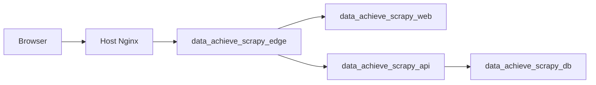
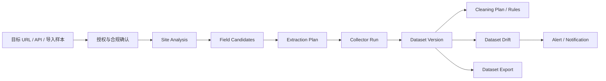
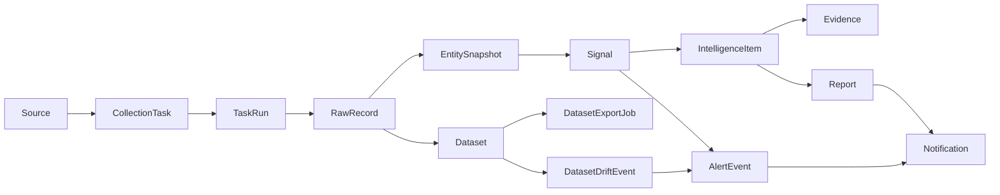

# Data Intelligence Hub 技术架构

## 架构目标

Data Intelligence Hub 是数据采集工作台，不是静态展示站。系统目标是把不同平台的数据采集方法、采集任务、原始记录、实体快照、变化信号、情报、报告、告警和通知串成可追溯闭环。

当前稳定边界：

1. 前端使用 Next.js 15 + React 19，生产环境关闭 mock API。
2. 后端使用 FastAPI + SQLAlchemy 2.0 + PostgreSQL。
3. 采集器支持 `github_repo`、`github_topic`、`generic_web`、`manual_json`、`ecommerce_product_discovery`、`ecommerce_product_page`。
4. 自动采集工作台通过 `/api/automation` 串联站点分析、商品发现、fan-out、批量运行、Dataset 保存、漂移检查、告警和导出。
5. 情报生成遵循证据优先：事实来自 RawRecord、EntitySnapshot、Signal、Evidence，LLM 或 mock LLM 只生成摘要文案。
6. 生产部署在腾讯云轻量服务器的独立 Docker Compose 环境内，不复用其他应用容器、数据库或 volume。

## 运行拓扑

生产容器：

| 服务 | 容器 | 职责 | 对外暴露 |
|---|---|---|---|
| `web` | `data_achieve_scrapy_web` | Next.js 页面服务 | 仅内部网络 |
| `api` | `data_achieve_scrapy_api` | FastAPI、调度器、采集与情报服务 | 仅内部网络 |
| `db` | `data_achieve_scrapy_db` | PostgreSQL 16 | 仅内部网络 |
| `edge` | `data_achieve_scrapy_edge` | Nginx 反向代理 `/api` 与页面 | 通过外部网关网络接入 |

网络与隔离：

1. `data_achieve_scrapy_internal` 只服务本项目。
2. `lighthouse_ai_video_net` 仅用于让宿主机网关 Nginx 访问 `edge`。
3. PostgreSQL volume 为 `data_achieve_scrapy_postgres_data`，不与其他应用共享。
4. 生产敏感配置只在 `/opt/data-achieve-scrapy/.env.production`，不进入仓库。

## 自动采集工作台闭环

当前产品定位已从“工具情报展示”推进为“自动化数据采集工作台”。工具情报仍保留，但它的架构角色是采集策略推荐层，而不是主链路。

自动采集主链路：

当前实现边界：

1. `SiteAnalysis` 与 `ExtractionPlan` 已升级为可保存、可查询、可复制版本的正式资产。
2. `CleaningPlan` 已升级为可保存、可试跑、可被数据集版本追踪的正式草案资产。
3. `Dataset`、`DatasetVersion`、`DatasetDriftEvent`、`DatasetExportJob` 已有后端模型与 `/datasets` 前端入口。
4. Dataset 导出文件写入 `Settings.dataset_export_dir`，默认值为 `tmp/dataset-exports`；生产持久化目录和对象存储策略需要在部署层单独核验。
5. 截至 commit `db6189f`，Automation 平台包、采集计划、清洗计划、数据集保存和生产浏览器链路已完成一轮生产验收；后续重点是更多平台包的真实采集深度与长期运行可靠性。

## 数据闭环

核心不变量：

1. `RawRecord` 是事实入口，必须保留 `content_hash` 和采集时间。
2. `EntitySnapshot` 是可比较状态，不直接覆盖历史。
3. `Signal` 只描述确定性变化或异常，不承载自由文本结论。
4. `IntelligenceItem` 的评分来自规则公式，摘要文案不能新增事实。
5. `Evidence` 必须能追溯到 signal、entity、raw record 或 URL。
6. Report、Alert、Notification 都消费已存在的情报和证据，不绕过证据链。
7. Dataset 是面向下游交付的结构化资产，必须能追溯到 TaskRun、RawRecord 和字段选择。
8. DatasetExportJob 是受控导出记录，必须记录格式、文件名、大小、行数、checksum 和审计事件。

## 模块分层

| 层 | 目录 | 职责 |
|---|---|---|
| API route | `apps/api/src/data_intelligence_hub/api/routes/` | HTTP 入口、鉴权上下文、schema 响应 |
| Service | `apps/api/src/data_intelligence_hub/services/` | 业务流程、采集运行、信号生成、情报生成、报告、告警、通知 |
| Repository | `apps/api/src/data_intelligence_hub/repositories/` | SQLAlchemy 查询与持久化 |
| Model | `apps/api/src/data_intelligence_hub/models/` | 数据表映射与关系 |
| Schema | `apps/api/src/data_intelligence_hub/schemas/` | Pydantic 请求与响应合同 |
| Web app | `apps/web/src/app/` | 页面路由 |
| Web lib | `apps/web/src/lib/` | API client、mock API、格式化工具 |
| Web types | `apps/web/src/types/` | 前端类型定义 |

## Automation 与 Dataset 模块

| 模块 | 主要文件 | 当前职责 |
|---|---|---|
| Automation routes | `apps/api/src/data_intelligence_hub/api/routes/automation.py` | `/api/automation` HTTP 入口 |
| Automation service | `apps/api/src/data_intelligence_hub/services/automation_service.py` | 站点分析、商品发现、fan-out、批量运行、Dataset、漂移、告警和导出流程 |
| Automation schemas | `apps/api/src/data_intelligence_hub/schemas/automation.py` | 自动采集请求与响应合同 |
| Dataset models | `apps/api/src/data_intelligence_hub/models/dataset.py` | Dataset、DatasetVersion、CleaningPlan、DatasetDriftEvent、DatasetExportJob |
| Dataset repository | `apps/api/src/data_intelligence_hub/repositories/datasets.py` | Dataset 查询、版本、漂移与导出任务持久化 |
| CleaningPlan repository | `apps/api/src/data_intelligence_hub/repositories/cleaning_plans.py` | CleaningPlan 查询、版本号和持久化 |
| Automation page | `apps/web/src/components/automation/automation-workbench.tsx` | 自动采集工作台 |
| Dataset page | `apps/web/src/components/datasets/datasets-workspace.tsx` | 数据集资产台、导出与漂移历史 |

后续应新增或拆分：

1. `PlatformPackage` 持久化和自定义层，用于 Shopify、GitHub/API-first、marketplace、social 等平台包的版本管理和交付验收。
2. 清洗计划规则编辑器和更完整的 before/after 预览。
3. 前端提交中状态、采集任务运行锁、重试预算和超时策略。

## 采集与调度

采集任务的稳定路径：

1. 创建 `Source`。
2. 执行配置校验。
3. 启用 source，生成或更新 `CollectionTask`。
4. 手动运行或调度器运行 task。
5. Collector 返回结构化 payload。
6. 写入 `TaskRun`、`RawRecord`。
7. Normalization 生成 `Entity` 与 `EntitySnapshot`。
8. Signal service 比较快照并生成 `Signal`。
9. Intelligence service 生成 `IntelligenceItem` 和 `Evidence`。
10. 自动采集流程可以从 TaskRun 聚合生成 DatasetVersion，并进一步生成 DatasetDriftEvent、AlertEvent、Notification 或 DatasetExportJob。

当前稳定 collector：

| type | 用途 |
|---|---|
| `github_repo` | 监控公开 GitHub 仓库指标 |
| `github_topic` | 按公开 topic 发现 GitHub 仓库 |
| `generic_web` | 采集公开网页快照 |
| `manual_json` | 导入人工或外部工具结构化样本 |
| `ecommerce_product_discovery` | 从独立站列表页或 sitemap 发现商品 URL |
| `ecommerce_product_page` | 从公开独立站商品页解析结构化商品字段 |

平台边界：

1. Shopify-style 独立站是当前第一平台包。
2. GitHub/API-first 平台包适合承接采集工具情报监控。
3. Amazon、Temu、Shopee、Lazada 等 marketplace 应优先走官方 API、授权导出或人工导入。
4. TikTok、Instagram、X、小红书等社媒平台在未明确授权和平台政策前，不实现登录态抓取、反检测或风控绕过。

调度器当前是进程内轻量调度，由 `SCHEDULER_ENABLED` 控制。生产 compose 支持开启，默认值由远程 `.env.production` 决定。后续如果任务规模增大，应把单 owner 机制升级为独立 worker 或 Temporal。

## LLM 边界

当前生产 `LLM_PROVIDER=mock`。这不是事实生成器，只是可插拔 adapter 的本地实现。

约束：

1. system prompt 固定要求基于 verified evidence。
2. user prompt 固定禁止编造事实。
3. adapter 返回值必须是 JSON object。
4. JSON 必须包含 string 类型的 `title` 与 `summary`。
5. 无效 JSON、非 object、非 string 字段统一抛出 `TypeError`。

真实 LLM 接入前必须保留同一 schema guard，并新增 provider 级超时、重试、配额和审计日志。

## 生产验收事实

截至 2026-06-14，已验证：

1. 本地 `bash scripts/verify-mvp.sh` 通过：API `45 passed`，Web build 通过，Playwright `17 passed, 5 skipped`。
2. 生产 `https://scrapy.lute-tlz-dddd.top/api/health` 返回 `production`、`ok`、`database=connected`。
3. 生产真实 API E2E 通过：Playwright `17 passed, 5 skipped`。
4. 演示数据项目域覆盖 `competitor`、`ecommerce`、`osint`、`social`。
5. 演示数据 collector 覆盖 `generic_web`、`github_repo`、`manual_json`。

截至 2026-06-19，本地仓库检查确认：

1. `/api/automation` 路由已存在，覆盖 site analysis、product discovery、fan-out、batch run、Dataset、drift、alert 和 export。
2. `DatasetExportJob` 模型、导出服务、导出历史接口和下载接口已存在。
3. 前端 `/datasets` 已存在生成导出文件和下载导出文件的交互。
4. 以上为本地仓库实现事实；是否已在生产环境部署仍需单独核验生产 SHA、容器状态和真实 E2E。
