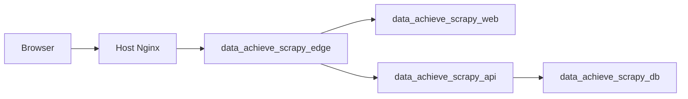
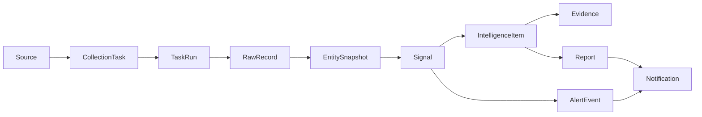

# Data Intelligence Hub 技术架构

## 架构目标

Data Intelligence Hub 是数据采集工作台，不是静态展示站。系统目标是把不同平台的数据采集方法、采集任务、原始记录、实体快照、变化信号、情报、报告、告警和通知串成可追溯闭环。

当前稳定边界：

1. 前端使用 Next.js 15 + React 19，生产环境关闭 mock API。
2. 后端使用 FastAPI + SQLAlchemy 2.0 + PostgreSQL。
3. 采集器支持 `github_repo`、`github_topic`、`generic_web`、`manual_json`。
4. 情报生成遵循证据优先：事实来自 RawRecord、EntitySnapshot、Signal、Evidence，LLM 或 mock LLM 只生成摘要文案。
5. 生产部署在腾讯云轻量服务器的独立 Docker Compose 环境内，不复用其他应用容器、数据库或 volume。

## 运行拓扑

生产容器：

| 服务 | 容器 | 职责 | 对外暴露 |
|---|---|---|---|
| `web` | `data_achieve_scrapy_web` | Next.js 页面服务 | 仅内部网络 |
| `api` | `data_achieve_scrapy_api` | FastAPI、调度器、采集与情报服务 | 仅内部网络 |
| `db` | `data_achieve_scrapy_db` | PostgreSQL 16 | 仅内部网络 |
| `edge` | `data_achieve_scrapy_edge` | Nginx 反向代理 `/api` 与页面 | 通过外部网关网络接入 |

网络与隔离：

1. `data_achieve_scrapy_internal` 只服务本项目。
2. `lighthouse_ai_video_net` 仅用于让宿主机网关 Nginx 访问 `edge`。
3. PostgreSQL volume 为 `data_achieve_scrapy_postgres_data`，不与其他应用共享。
4. 生产敏感配置只在 `/opt/data-achieve-scrapy/.env.production`，不进入仓库。

## 数据闭环

核心不变量：

1. `RawRecord` 是事实入口，必须保留 `content_hash` 和采集时间。
2. `EntitySnapshot` 是可比较状态，不直接覆盖历史。
3. `Signal` 只描述确定性变化或异常，不承载自由文本结论。
4. `IntelligenceItem` 的评分来自规则公式，摘要文案不能新增事实。
5. `Evidence` 必须能追溯到 signal、entity、raw record 或 URL。
6. Report、Alert、Notification 都消费已存在的情报和证据，不绕过证据链。

## 模块分层

| 层 | 目录 | 职责 |
|---|---|---|
| API route | `apps/api/src/data_intelligence_hub/api/routes/` | HTTP 入口、鉴权上下文、schema 响应 |
| Service | `apps/api/src/data_intelligence_hub/services/` | 业务流程、采集运行、信号生成、情报生成、报告、告警、通知 |
| Repository | `apps/api/src/data_intelligence_hub/repositories/` | SQLAlchemy 查询与持久化 |
| Model | `apps/api/src/data_intelligence_hub/models/` | 数据表映射与关系 |
| Schema | `apps/api/src/data_intelligence_hub/schemas/` | Pydantic 请求与响应合同 |
| Web app | `apps/web/src/app/` | 页面路由 |
| Web lib | `apps/web/src/lib/` | API client、mock API、格式化工具 |
| Web types | `apps/web/src/types/` | 前端类型定义 |

## 采集与调度

采集任务的稳定路径：

1. 创建 `Source`。
2. 执行配置校验。
3. 启用 source，生成或更新 `CollectionTask`。
4. 手动运行或调度器运行 task。
5. Collector 返回结构化 payload。
6. 写入 `TaskRun`、`RawRecord`。
7. Normalization 生成 `Entity` 与 `EntitySnapshot`。
8. Signal service 比较快照并生成 `Signal`。
9. Intelligence service 生成 `IntelligenceItem` 和 `Evidence`。

调度器当前是进程内轻量调度，由 `SCHEDULER_ENABLED` 控制。生产 compose 支持开启，默认值由远程 `.env.production` 决定。后续如果任务规模增大，应把单 owner 机制升级为独立 worker 或 Temporal。

## LLM 边界

当前生产 `LLM_PROVIDER=mock`。这不是事实生成器，只是可插拔 adapter 的本地实现。

约束：

1. system prompt 固定要求基于 verified evidence。
2. user prompt 固定禁止编造事实。
3. adapter 返回值必须是 JSON object。
4. JSON 必须包含 string 类型的 `title` 与 `summary`。
5. 无效 JSON、非 object、非 string 字段统一抛出 `TypeError`。

真实 LLM 接入前必须保留同一 schema guard，并新增 provider 级超时、重试、配额和审计日志。

## 生产验收事实

截至 2026-06-14，已验证：

1. 本地 `bash scripts/verify-mvp.sh` 通过：API `45 passed`，Web build 通过，Playwright `17 passed, 5 skipped`。
2. 生产 `https://scrapy.lute-tlz-dddd.top/api/health` 返回 `production`、`ok`、`database=connected`。
3. 生产真实 API E2E 通过：Playwright `17 passed, 5 skipped`。
4. 演示数据项目域覆盖 `competitor`、`ecommerce`、`osint`、`social`。
5. 演示数据 collector 覆盖 `generic_web`、`github_repo`、`manual_json`。
