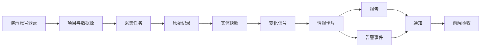

# 真实数据闭环实施计划

## 目标

把当前已上线的高保真前端原型推进为可验收的 MVP 真实闭环：

1. 前端关闭 mock API，直接访问线上 FastAPI。
2. FastAPI 使用独立 PostgreSQL 持久化数据。
3. 演示账号具备完整业务样本数据，覆盖项目、数据源、采集任务、原始记录、实体、信号、情报、报告、告警、通知。
4. 线上通过 API smoke、浏览器 E2E、容器健康检查和既有域名回归验证。
5. 所有新增部署资产保持独立 Docker 环境，不污染服务器其他应用。

## 非目标

以下能力不阻塞本轮闭环上线，但必须进入后续差距修复：

1. 真实周期调度和采集队列。
2. 外部邮件发送适配器。
3. LLM 线上推理服务接入。
4. 大规模租户权限矩阵。
5. 复杂证据图谱可视化。

## 当前事实

1. 线上域名 `https://scrapy.lute-tlz-dddd.top` 已部署可访问。
2. 线上前端已切换为 `NEXT_PUBLIC_MOCK_API=false`，主要业务页读取真实 FastAPI。
3. 后端 FastAPI、PostgreSQL、Web、Edge 已纳入独立 Docker Compose 编排。
4. Alembic 迁移和演示种子数据已在线上执行通过。
5. 线上 API smoke 和真实 API E2E 已通过，调度闭环已补轻量调度骨架。
6. 证据闭环已补审计上下文：Evidence API 返回 Signal、Entity、RawRecord、TaskRun、Source 追溯信息，前端审计抽屉和报告情报链接已接入。

## 闭环路径



## 阶段 1：一体化隔离部署资产

交付物：

1. `apps/api/Dockerfile`
2. `apps/api/.dockerignore`
3. `configs/deploy/scrapy/docker-compose.yml`
4. `configs/deploy/scrapy/edge-nginx.conf`

实施要求：

1. Compose 内包含 `db`、`api`、`web`、`edge` 四类服务。
2. PostgreSQL 只接入 `data_achieve_scrapy_internal`，不暴露宿主机端口。
3. API 只通过内部网络给 `edge` 访问，不暴露宿主机端口。
4. `edge` 继续通过既有 `lighthouse_ai_video_net` 暴露给服务器网关 nginx。
5. Web 构建参数切换为 `NEXT_PUBLIC_MOCK_API=false`。
6. 生产敏感值通过远程 `.env.production` 注入，不提交仓库。

验收：

1. 本地 `docker compose config` 通过。
2. API 镜像能完成依赖安装。
3. `edge` 能代理 `/api/health` 到 FastAPI。

## 阶段 2：演示数据种子

交付物：

1. `apps/api/src/data_intelligence_hub/seed/demo_data.py`
2. `apps/api/src/data_intelligence_hub/seed/__init__.py`

实施要求：

1. 种子脚本幂等，重复执行不制造重复主数据。
2. 创建演示账号、工作区、项目、数据源、采集任务、原始记录、实体、实体快照、变化信号、情报、证据、报告、告警事件、通知。
3. 数据内容与当前产品形态一致，能支撑 `/dashboard`、`/tasks`、`/reports`、`/alerts`、`/notifications` 等主要页面。
4. 运行方式固定为：

```bash
uv run python -m data_intelligence_hub.seed.demo_data
```

验收：

1. 空库迁移后执行成功。
2. 重复执行成功且关键记录数量不翻倍。
3. 登录演示账号后主要列表接口返回非空数据。

## 阶段 3：真实 API smoke

交付物：

1. `scripts/smoke-api-scrapy.sh`

实施要求：

1. 脚本通过环境变量接收 `BASE_URL`、`SCRAPY_DEMO_EMAIL`、`SCRAPY_DEMO_PASSWORD`。
2. 验证 `/api/health`。
3. 登录并保存 cookie。
4. 验证 `/api/auth/me`、`/api/dashboard/overview`、`/api/tasks`、`/api/reports`、`/api/alert-events`、`/api/notifications`。
5. 输出明确失败位置。

验收：

1. 本地指向开发服务可运行。
2. 线上指向 `https://scrapy.lute-tlz-dddd.top` 可运行。

## 阶段 4：前端真实 API 稳定化

交付物：

1. 登录后真实 cookie 会话可用于所有业务页面。
2. 未登录访问业务页时给出明确登录入口。
3. 主要页面真实 API 请求失败时显示可恢复错误态。
4. E2E 支持真实 API 登录前置流程。

验收：

1. mock 模式 E2E 继续通过。
2. 真实 API 模式 E2E 至少覆盖登录、任务、报告、告警、通知。
3. 页面无明显横向溢出和阻塞型 console error。

## 阶段 5：线上切换与验收

执行顺序：

1. 在服务器 `/opt/data-achieve-scrapy` 备份当前部署文件。
2. 同步代码到服务器。
3. 生成服务器私有 `.env.production`。
4. 执行生产部署 preflight。
5. 构建新镜像。
6. 启动 PostgreSQL 和 API。
7. 执行 Alembic 迁移。
8. 执行演示数据种子。
9. 启动 web 和 edge。
10. 执行 API smoke。
11. 执行线上 E2E。
12. 回归检查既有域名 `video.lute-tlz-dddd.top`、`mkt.lute-tlz-dddd.top`、`voc.lute-tlz-dddd.top`。

> 说明：生产 compose 运行与重建需显式加载 `.env.production`，否则数据库口令会回退默认值。  
> 推荐在 `app` 目录下执行：  
> `docker compose --env-file ../.env.production -f configs/deploy/scrapy/docker-compose.yml up -d --force-recreate`

部署前必须先运行：

```bash
bash scripts/deploy-preflight-scrapy.sh \
  --env-file /opt/data-achieve-scrapy/.env.production \
  --compose-file configs/deploy/scrapy/docker-compose.yml
```

验收：

1. `https://scrapy.lute-tlz-dddd.top/api/health` 返回健康状态。
2. 演示账号可登录。
3. 主要业务页面展示真实 API 数据。
4. E2E 全部通过或仅跳过已明确非本轮目标的用例。
5. 服务器其他应用 200 回归通过。

## 阶段 6：PRD 差距修复

优先级：

1. P0：调度闭环。实现采集任务触发、状态流转、失败记录和重试边界。当前已补进程内轻量调度骨架，受 `SCHEDULER_ENABLED` 控制；生产 compose 默认关闭，待真实数据源和单 owner 机制确认后开启。
2. P0：证据闭环。已实现情报详情/列表审计抽屉中的 Signal、Entity、RawRecord、TaskRun、Source 追溯；报告正文中的情报 ID 可跳转情报详情。精确 claim span 仍等待 LLM 输出 schema。
3. P1：报告交互。报告章节展开、证据引用详情、导出入口真实可用。
4. P1：告警处置。告警事件支持确认、静默、关联任务。
5. P1：通知偏好。通知渠道和已读状态真实持久化。
6. P2：邮件发送。接入 SMTP 或第三方邮件服务，并保留本地假发送器。生产环境在 `/opt/data-achieve-scrapy/.env.production` 使用 `SCRAPY_SMTP_HOST`、`SCRAPY_SMTP_PORT`、`SCRAPY_SMTP_USER`、`SCRAPY_SMTP_PASSWORD`、`SCRAPY_SMTP_FROM`，由 `configs/deploy/scrapy/docker-compose.yml` 映射到 API 容器内的 `SMTP_*` 配置。
7. P2：LLM 增强。把规则生成的情报升级为可配置 LLM 解释层。

## 回滚策略

1. 不删除当前远程项目目录，只覆盖部署资产前先备份。
2. PostgreSQL 使用独立 Docker volume，不与其他应用共享。
3. 如果真实 API 切换失败，恢复上一版 compose 和 `NEXT_PUBLIC_MOCK_API=true` 镜像。
4. 如果网关 nginx 出现异常，恢复既有备份文件：

```bash
/opt/ai-video/deploy/lighthouse/nginx.conf.bak-data-achieve-scrapy-20260612195543
```

## 完成定义

本轮闭环完成的最低标准：

1. 线上不再依赖前端 mock 数据。
2. 演示账号从 PostgreSQL 读取完整业务链路数据。
3. API smoke 与浏览器 E2E 均通过。
4. 服务器其他应用没有回归问题。
5. 剩余 PRD gap 有明确 P0/P1/P2 排期，不混入本轮上线范围。
